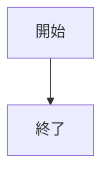
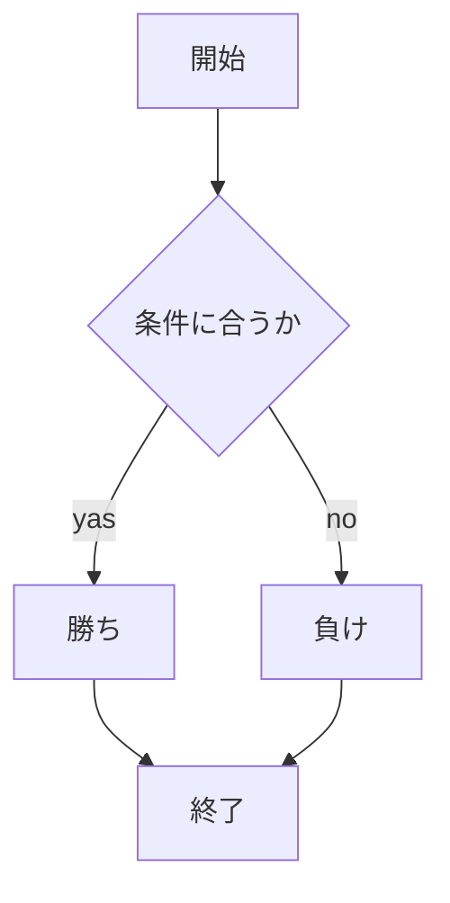

# レポート課題

## webpro_06のadd5.jsのプログラムについて
本課題ではGithubのwebpro_06のリポジトリをFrokしてapp5.jsを改造し，じゃんけん以外にユーザからの入力に対して結果を返す機能を2つ追加した．今回はjanken以外にactionとlookという機能を追加した．本レポートではapp5.js全体の内容を説明するドキュメントを記した．

## ファイルについて
本課題にて使用したファイルの名前と内容を一覧にまとめた．
ファイル名 | 説明
-|-
app5.js | janken,action,lookの機能などがプログラムが書かれている本体
public/janken.html | jankenの開始画面
views/janken.ejs | jankenのテンプレートファイル
public/action.html | actionの開始画面
views/action.ejs | actionのテンプレートファイル
public/look.html | lookの開始画面
views/look.ejs | lookのテンプレートファイル
###　ファイルの内容説明
1. app5.js
jankenやaction,lookなどの機能のプログラムが記されているファイルである．
1. public/janken.html

1. views/janken.ejs

1. public/action.html

1. views/action.ejs

1. public/look.html

1. views/look.ejs

```javascript
console.log('Hello');
```

##　起動方法

### GithubのリポジトリをFrokする方法
1. https://github.com/shibayuzu/webpro_06　をGithubで起動する
1. 右上あたりの```Frok```ボタンをクリックする
1. ```owner```というところで自分のアカウントを選択する
1. 左下の緑色のボタン```Create frok```

この順番に従って行うことでGithubのリポジトリをFrokすることができる．

### Frokしたリポジトリをcloneする方法
1. FrokしたリポジトリをGithubで開く
1. 右上あたりの緑色の```Code```ボタンをクリックする
1. 一番上にあるURLをコピーする
1. ターミナルを開く
1. ```git clone```のあとに手順３でコピーしたURLをはる
1. ```cd webpro_06```を入力する

この順番に沿って行うことでcloneが可能であり，実際にVSCodeでファイルを編集することができるようになる．

##　編集方法
リポジトリにFrok，cloneを行うとVSCodeでファイルを編集することができるようになる．その編集が終わったらターミナルでGitコマンドを使用してリポジトリに保存をする．保存をするにはまず，ユーザ名とメールアドレスを登録する必要がある．


###　Gitコマンドによるユーザ名とメールアドレスの登録
1. ターミナルのcdコマンドでwebpro_06まで
1. ユーザ名を登録するには```git config --global user.name "Yuzu shibazaki”```と入力する
1. メールアドレスを登録するには```$ git config --global user.email "s24g1071qr@s.chibakoudai.jp"```と入力する

Gitコマンドでユーザ名とメールアドレスを登録することでVSCodeで修正や追加をしたファイルをアップロードすることができる．ファイルをアップロードするにもGitコマンドを使用する．

### githubにファイルをアップロードする
1. ```git add .```
1. ```git commit -am ‘コメント'```
1. ``` git push```


ここでGithubのアクセストークンを入力する


1. ```app5.js```を起動する
1. Wedブラウザでlocalhost:8080/pubkic/janken.htmlにアクセスする
1. 自分の手を入力する



