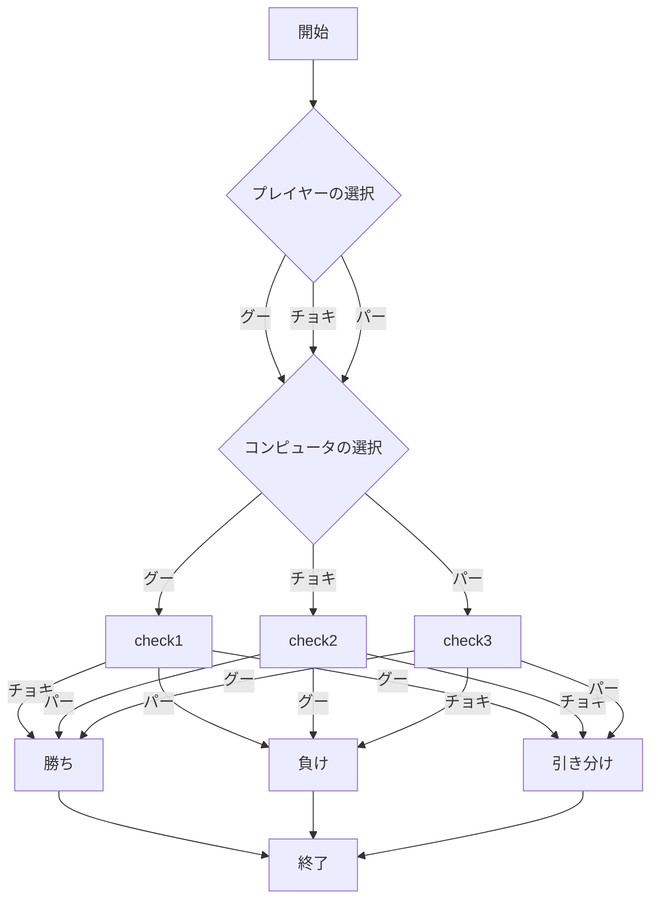
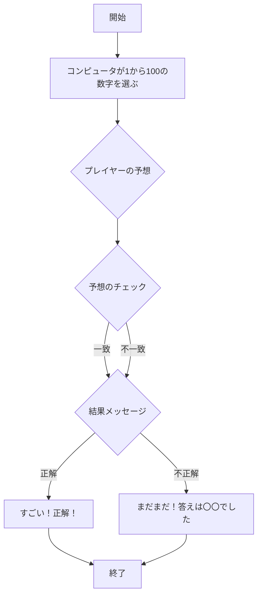
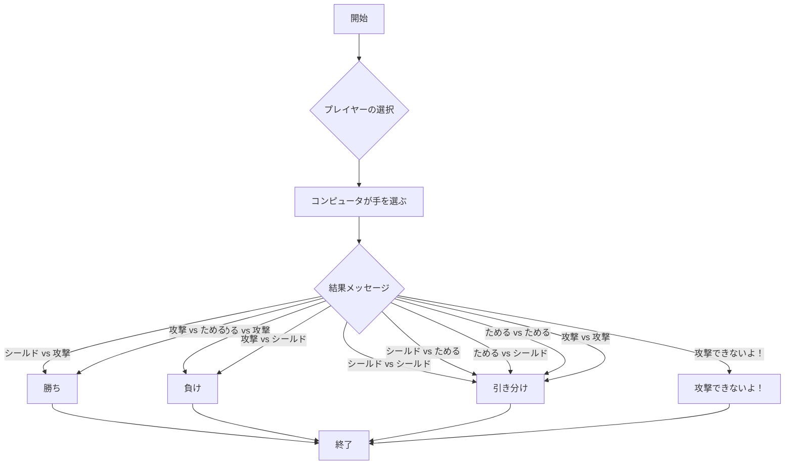

# レポート課題

## webpro_06のadd5.jsのプログラムについて
本課題ではGithubのwebpro_06のリポジトリをFrokしてapp5.jsを改造し，じゃんけん以外にユーザからの入力に対して結果を返す機能を2つ追加した．今回はjanken以外にlookとactionという機能を追加した．本レポートではapp5.js全体の内容を説明するドキュメントを記した．

## ファイルについて
本課題にて使用したファイルの名前と内容を一覧にまとめた．
ファイル名 | 説明
-|-
app5.js | janken,action,lookの機能などがプログラムが書かれている本体
public/janken.html | jankenの開始画面
views/janken.ejs | jankenのテンプレートファイル
public/look.html | lookの開始画面
views/look.ejs | lookのテンプレートファイル
public/action.html | actionの開始画面
views/action.ejs | actionのテンプレートファイル

#### 機能の説明
本課題で作成したjanken，look，actionの機能を説明する

・janken
じゃんけんができる機能である．グー，チョキ，パーを入力することができる．グーはチョキに勝ち，チョキはパーに勝ち，パーはグーに勝つという仕様になっている．



・look
数字当てゲームができる機能である．1から100の中からランダムで一つをcpuが選び，それがなんの数字であるかを当てるという仕様になっている．


・action
簡単な対戦ができる機能である．シールド，ためる，攻撃を入力することができる．シールドは攻撃から守る役割，ためるは攻撃を一回するために必要な行動，攻撃は相手を倒すことができる役割で構成されている．


##　起動方法

### GithubのリポジトリをFrokする方法
1. https://github.com/shibayuzu/webpro_06　をGithubで起動する
1. 右上あたりの```Frok```ボタンをクリックする
1. ```owner```というところで自分のアカウントを選択する
1. 左下の緑色のボタン```Create frok```

この順番に従って行うことでGithubのリポジトリをFrokすることができる．

### Frokしたリポジトリをcloneする方法
1. FrokしたリポジトリをGithubで開く
1. 右上あたりの緑色の```Code```ボタンをクリックする
1. 一番上にあるURLをコピーする
1. ターミナルを開く
1. ```git clone```のあとに手順３でコピーしたURLをはる
1. ```cd webpro_06```を入力する

この順番に沿って行うことでcloneが可能であり，実際にVSCodeでファイルを編集することができるようになる．

##　編集方法
リポジトリにFrok，cloneを行うとVSCodeでファイルを編集することができるようになる．その編集が終わったらターミナルでGitコマンドを使用してリポジトリに保存をする．保存をするにはまず，ユーザ名とメールアドレスを登録する必要がある．


###　Gitコマンドによるユーザ名とメールアドレスの登録
1. ターミナルのcdコマンドでwebpro_06まで
1. ユーザ名を登録するには```git config --global user.name "shibayuzu”```と入力する
1. メールアドレスを登録するには```$ git config --global user.email "fuyounoco@gmail.com"```と入力する

Gitコマンドでユーザ名とメールアドレスを登録することでVSCodeで修正や追加をしたファイルをアップロードすることができる．ファイルをアップロードするにもGitコマンドを使用する．

### githubにファイルをアップロードする
```git add .```
```git commit -am ‘コメント'```
```git push```
この順番にコマンドを実行する．そして，ここでGithubのアクセストークンを入力する．これらのコマンドをターミナルで実行することで，Githubに修正や追加をしたファイルをアップロードすることができる．

##　プログラムの実行
修正や追加をしたリポジトリを実際に機能を実行するための手順が必要である．

1. ```cd webpro_06```を入力
1. Node.jsの環境で必要なパッケージを入手するために```npm install```を入力
1. 実際にプログラムを実行するために```node app.js```
1. ```telnet localhost 8080```
1. ```GET /luck HTTP/1.1```
1. ```Host: localhost```
1. ```http://localhost:8080/janken```